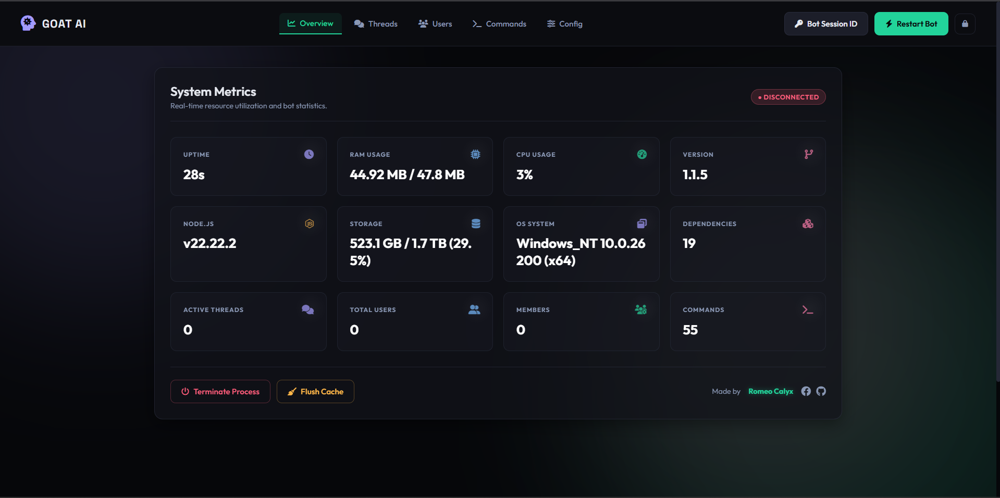

<div align="center">
  <h1>🐐 WAGoat-Bot</h1>
  <p><b>A powerful, event-driven WhatsApp bot built on <code>@whiskeysockets/baileys</code> with a comprehensive FCA-compatible API layer.</b></p>

 
  
  [](https://romeobot-paircode.onrender.com/)
  [](https://prime-pair-web-0rst.onrender.com/pair2)
  [](https://github.com/efkidgamerdev/WAGOAT-BOT)
  [](https://nodejs.org/)
  [](LICENSE)
</div>

<br/>
 <div align="center">
    
</div>
  
## 📖 Table of Contents
- [Features](#features)
- [Quick Start](#quick-start)
- [Authentication & Login](#authentication-login)
- [Configuration](#configuration)
- [Web Dashboard](#web-dashboard)
- [Project Architecture](#project-architecture)
- [Development Guide](#development-guide)
  - [Writing Commands](#writing-commands)
  - [Writing Events](#writing-events)
  - [API Reference](#api-reference)
- [Command Management](#command-management)
- [Creator & Maintainer](#creator-and-maintainer)
- [License](#license)


<a id="features"></a>
## ✨ Features

- **Event-Driven Architecture**: Fully modular command and event handling.
- **Web Dashboard**: Built-in Express & Socket.IO web interface to monitor bot status live.
- **Hot Reloading**: Install, load, and reload commands without restarting the bot.
- **Robust Multi-Device Support**: Built on the latest Baileys library for stable connection.
- **Flexible Login Methods**: Supports QR Code, Pair Code (Terminal), and Session ID strings.
- **JSON & MongoDB Support**: Integrated database system out of the box.
- **Rich Messaging API**: Simplified methods to send images, videos, audio, documents, and interactive messages.

<a id="quick-start"></a>
## 🚀 Quick Start

Ensure you have [Node.js 18+](https://nodejs.org/) installed.

```bash
git clone https://github.com/efkidgamerdev/WAGOAT-BOT.git
cd WAGOAT-BOT
npm install
npm start
```

The bot will print a **Pairing Code** in your terminal. 
To authenticate, open **WhatsApp** on your phone → **Linked Devices** → **Link a Device** → **Link with phone number instead** → Enter the 8-digit code.

---

<a id="authentication-login"></a>
## 🔐 Authentication & Login

Goatbot offers multiple ways to authenticate. We highly recommend using the **Session ID** method for cloud deployments (Heroku, Railway, Render, etc.).

<summary><b>Method 1: Pair Code (Terminal) - Default</b></summary>
<br>

Set your phone number in `config.json`:
```json
{
  "phoneNumber": "8801XXXXXXXXX",
  "loginMode": "pair"
}
```
Run `npm start` and enter the 8-digit code shown in the terminal into your WhatsApp Linked Devices screen.


<summary><b>Method 2: Session ID (Recommended for Cloud)</b></summary>
<br>

### 🔄 Step 1: Fork This Repository

<div align="center">
  <a href="https://github.com/efkidgamerdev/WAGOAT-BOT/fork">
    
  </a>
</div>

<div align="center">
  <a href="https://github.com/efkidgamerdev/WAGOAT-BOT">
    
  </a>
</div>

### 🔑 Step 2: Generate Your Pairing Code

<div align="center">
  <a href='https://prime-pair-web-0rst.onrender.com/pair2' target="_blank">
    
  </a>
  <a href='https://romeobot-paircode.onrender.com/' target="_blank">
    
  </a>
</div>


2. Copy the session string and place it in `config.json`:
   ```json
   {
     "sessionID": "YOUR_SESSION_STRING_HERE",
     "loginMode": "pair"
   }
   ```
   *Alternatively, set the `SESSION_ID` environment variable.*
3. Run `npm start`. The bot will automatically import the credentials and clear the `sessionID` field for security.


<summary><b>Method 3: QR Code</b></summary>
<br>

Set your login mode in `config.json`:
```json
{
  "loginMode": "qr"
}
```
Run `npm start` and scan the QR code that appears in the terminal using WhatsApp.


---

<a id="configuration"></a>
## ⚙️ Configuration

Control your bot's behavior by modifying `config.json`.

```json
{
  "prefix": ".",
  "botName": "WAGoat-Bot",
  "language": "en",
  "adminBot": ["YOUR_WHATSAPP_ID_HERE"],
  "phoneNumber": "8801XXXXXXXXX",
  "loginMode": "pair",
  "sessionID": "",
  "authFolder": "./auth",
  "database": {
    "type": "json"
  },
  "listen": {
    "selfListen": false,
    "listenEvents": true
  },
  "featureBox": {
    "adminOnly": false,
    "antiInbox": false,
    "unsendBotReact": true
  }
}
```

> **Pro Tip:** Set `featureBox.adminOnly` to `true` during maintenance to prevent standard users from triggering commands.

---

<a id="web-dashboard"></a>
## 📊 Web Dashboard

Goatbot includes a built-in, real-time web dashboard running on **Express & Socket.IO**. 

Once the bot starts successfully, you can access the dashboard by visiting:
**http://localhost:3000/dashboard** (or your server's exposed port if deploying to the cloud).

**Dashboard Features:**
- 📈 Live uptime, memory usage, and ping monitoring
- 📋 Real-time view of loaded commands and events
- 🧑‍🤝‍🧑 Overview of total users and active threads
- ⚡ Live terminal log output directly in your browser

<div align="center">
  
</div>

---

<a id="project-architecture"></a>
## 🏗️ Project Architecture

```text
WAGoat-Bot/
├── Goat.js                  # Main entry point
├── index.js                 # Process manager & auto-restart wrapper
├── config.json              # Global configuration
├── bot/
│   ├── handler/             # Event, action, and data controllers
│   └── login/               # Baileys adapter & socket logic
├── dashboard/               # Web dashboard UI & backend
├── database/                # Database controllers (JSON/MongoDB)
├── scripts/
│   ├── cmds/                # Command plugins (.js)
│   └── events/              # Event plugins (.js)
├── logger/                  # Console logging utilities
└── utils.js                 # Helper functions
```

---

<a id="development-guide"></a>
## 💻 Development Guide

<a id="writing-commands"></a>
### Writing Commands

Create a new JavaScript file in `scripts/cmds/`. 

```javascript
"use strict";

module.exports = {
  config: {
    name: "ping",
    version: "1.0.0",
    author: "YourName",
    countDown: 3,         // Cooldown in seconds
    role: 0,              // 0: Everyone, 1: Group Admin, 2: Bot Admin
    shortDescription: "Check bot latency",
    category: "system",
    guide: { en: "{pn}" } // {pn} is replaced by prefix + command name
  },

  onStart: async ({ api, event, args, message }) => {
    return message.reply("🏓 Pong!");
  }
};
```

#### Command Hooks

| Hook | When it fires |
|---|---|
| `onStart` | User triggers the command with the prefix |
| `onChat` | Fires on every single message (no prefix needed) |
| `onReply` | User replies to a registered bot message |
| `onReaction` | User reacts to a registered bot message |

#### 📡 Handling onReply & onReaction

**1. Register a reply listener:**
```javascript
const info = await message.reply("Reply with a number:");

global.GoatBot.onReply.set(info.messageID, {
  commandName: "choose", // Must match your command name
  author: event.senderID,
  data: ["Option A", "Option B", "Option C"]
});
```

**2. Handle the reply in your command:**
```javascript
onReply: async ({ event, Reply, message }) => {
  if (event.senderID !== Reply.author) return; // Only author can reply
  await message.reply(`You chose: ${Reply.data[event.body - 1]}`);
}
```

#### Message Helper API

The `message` object simplifies interactions:
```javascript
await message.reply("Standard reply");
await message.send("Send to specific thread", threadID);
await message.react("👍");
await message.unsend(messageID);
await message.edit(messageID, "Edited content");
```

**Sending Media:**
```javascript
await message.reply({
  body: "Check out this image!",
  attachment: { type: "image", url: "https://example.com/photo.jpg" }
});
```

---

<a id="writing-events"></a>
### Writing Events

Create a new JavaScript file in `scripts/events/`.

```javascript
"use strict";

module.exports = {
  config: {
    name: "welcome",
    version: "1.0.0",
    author: "YourName",
    category: "events"
  },

  onStart: async ({ api, event }) => {
    if (event.logMessageType === "log:subscribe") {
      for (const uid of event.participants) {
         await api.sendMessage(`👋 Welcome!`, event.threadID);
      }
    }
  }
};
```

#### Supported Event Types

| `event.type` | Description |
|---|---|
| `message` | Regular chat message |
| `message_reaction` | User adds/removes a reaction |
| `event` | Group participant change |
| `group_update` | Group name or settings changed |

#### Group Log Types (`event.logMessageType`)

| Value | Trigger |
|---|---|
| `log:subscribe` | User(s) joined a group |
| `log:unsubscribe` | User(s) left or were removed |
| `log:thread-admins` | Admin promoted / demoted |
| `log:thread-name` | Group name was changed |

---

<a id="api-reference"></a>
### API Reference

Goatbot provides a robust `api` object (wrapper around Baileys) to interact with WhatsApp.

<summary><b>Click to expand API methods</b></summary>
<br>

**Messaging**
- `api.sendMessage(content, threadID, options)`
- `api.sendImage(buffer, threadID, caption, options)`
- `api.sendVideo(buffer, threadID, caption, options)`
- `api.sendAudio(buffer, threadID, options)`
- `api.sendPTT(buffer, threadID, options)`
- `api.sendDocument(buffer, threadID, fileName, options)`
- `api.sendSticker(buffer, threadID, options)`
- `api.sendGif(buffer, threadID, caption, options)`
- `api.sendMedia(buffer, threadID, type, caption, options)`
- `api.sendLocation(threadID, latitude, longitude, options)`
- `api.sendPoll(threadID, question, options)`
- `api.sendButtons(threadID, text, buttons, options)`
- `api.sendList(threadID, title, buttonText, sections, options)`
- `api.sendTemplate(threadID, text, templateButtons, options)`

**Message Actions**
- `api.reactToMessage(threadID, key, emoji)`
- `api.deleteMessage(threadID, key, forEveryone)`
- `api.editMessage(threadID, messageID, newText)`
- `api.pinMessage(threadID, messageID, duration)`
- `api.unpinMessage(threadID, messageID)`
- `api.updateMediaMessage(msgObj)`
- `api.downloadMedia(msgObj)`

**Group Management**
- `api.getGroupInfo(threadID)`
- `api.getGroupInviteLink(threadID)`
- `api.groupRevokeInvite(threadID)`
- `api.groupAcceptInvite(code)`
- `api.groupSettingUpdate(threadID, setting, value)`
- `api.kickUser(threadID, jids)`
- `api.promoteAdmin(threadID, jids)`
- `api.demoteAdmin(threadID, jids)`
- `api.getGroupAdmins(threadID)`
- `api.createGroup(title, participants)`
- `api.leaveGroup(threadID)`
- `api.getAllGroups()`
- `api.addUserToGroup(threadID, jid)`
- `api.removeUserFromGroup(threadID, jid)`
- `api.changeGroupSubject(threadID, subject)`
- `api.changeGroupDescription(threadID, description)`

**User & Profile**
- `api.getCurrentUserID()`
- `api.getUserInfo(jid)`
- `api.getDMInfo(jid)`
- `api.getContacts()`
- `api.getChats()`
- `api.getProfilePicture(jid)`
- `api.updateProfilePicture(buffer)`
- `api.updateProfileStatus(status)`
- `api.updateProfileName(name)`
- `api.fetchStatus(jid)`

**Presence & Receipts**
- `api.sendTypingIndicator(threadID, duration)`
- `api.sendPresenceUpdate(jid, presence)`
- `api.sendReadReceipt(threadID, participant, messageIds)`
- `api.markAsRead(threadID, participant, messageIds)`

**Chat Moderation**
- `api.muteChat(threadID, duration)`
- `api.unmuteChat(threadID)`
- `api.archiveChat(threadID, archive)`
- `api.unarchiveChat(threadID)`
- `api.pinChat(threadID, pin)`
- `api.blockContact(jid)`
- `api.unblockContact(jid)`


---

<a id="command-management"></a>
## 🔄 Command Management

You can manage commands and events on-the-fly using the built-in `cmd` and `event` plugins. *(Bot Admin only)*

| Usage | Description |
|---|---|
| `!cmd install <file.js> <url>` | Download & install a command from a raw URL |
| `!cmd loadall` | Hot reload every command in the `scripts/cmds/` folder |
| `!cmd load <name>` | Enable a single command |
| `!cmd unload <name>` | Disable a command |
| `!cmd reload <name>` | Refresh a command to apply code changes |

---
<a id="creator-and-maintainer"></a>
### 🙏 Creator & Maintainer

- **[Romeo Calyx](https://github.com/RomeoCalyx)** - Lead Developer & Maintainer
- **[efkidgamerdev](https://github.com/efkidgamerdev)** - Co-Developer

---
<a id="license"></a>
## ⚖️ License

Distributed under the [MIT License](LICENSE). This project with credit **Sheikh Tamim**. Modified by **WAGoat-Bot Team**.
